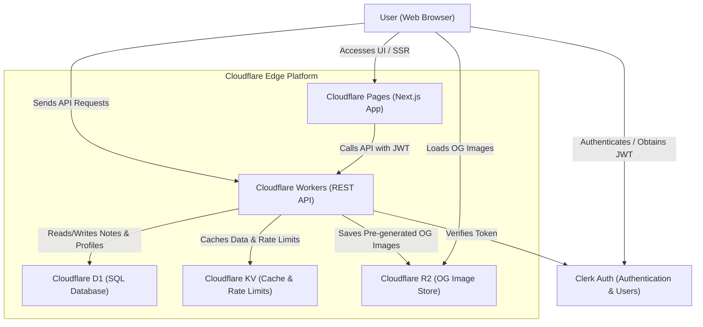

# 🧘 Zennote - Paste. Beautify. Share.

_Zennote turns messy AI markdown into beautiful, shareable notes — instantly._

---

## 🌟 What is Zennote?

Zennote is a markdown beautifier built for the modern age of AI and instant sharing.  
It takes unstructured markdown (often copied from AI tools), beautifies it with a clean design, and gives you a shareable URL — all in seconds.

Perfect for:

- Sharing AI responses or dev notes
- Creating clean, shareable docs from markdown
- Personal knowledge management

---

## 🛠️ Tech Stack

| Layer      | Tech                                                                 |
| ---------- | -------------------------------------------------------------------- |
| Frontend   | [Next.js 15](https://nextjs.org/) + Tailwind CSS                     |
| Backend    | [Cloudflare Workers](https://workers.cloudflare.com/) (TypeScript)   |
| Auth       | [Clerk](https://clerk.com/) for authentication                       |
| Storage    | [Cloudflare R2](https://developers.cloudflare.com/r2/) for OG images |
| DB         | [Cloudflare D1](https://developers.cloudflare.com/d1/) for metadata  |
| Cache      | Cloudflare KV for caching and rate limiting                          |
| Deployment | Cloudflare Pages & Workers via Wrangler                              |

### 🌐 Cloudflare Services Architecture



For a detailed breakdown of the system architecture and data flows, check out the [Architecture Guide](docs/architecture.md).

---

## 🧭 Project Structure

```
zennote/
├── apps/
│   ├── backend/       # Cloudflare Worker logic
│   │   ├── src/       # Worker source code (index.ts)
│   │   └── migrations/ # DB migrations (D1)
│   └── frontend/      # Next.js app
│       └── src/       # App Router setup, components, libs, config
├── docs/              # System documentation & setup guides
│   ├── api.md
│   ├── architecture.md
│   ├── database_setup.md
│   ├── migration_guide.md
│   └── r2_cdn_setup.md
├── .gitignore
├── LICENSE
└── README.md
```

---

## 🚀 Deployment & Hosting

Zennote uses **Cloudflare's full stack** for hosting:

- **Frontend** is deployed using [Cloudflare Pages](https://pages.cloudflare.com/)
- **Backend API** is a Cloudflare Worker deployed via `wrangler`
- **R2** stores pre-generated OG images (served via public URL)
- **D1** stores metadata (notes, users, profiles, access permissions)
- **KV** provides caching and rate limiting

Configuration files:

- `apps/backend/wrangler.toml` - Worker configuration
- `apps/backend/migrations/` - Database schema migrations

---

## 🧪 Local Development

### Prerequisites

- Node.js 18+
- Cloudflare account (for Wrangler)
- Clerk account (for authentication)

### Setup

```bash
# Clone the repo
git clone https://github.com/your-username/zennote.git
cd zennote

# Frontend setup
cd apps/frontend
npm install
# Create .env.local with:
# - NEXT_PUBLIC_API_URL=http://localhost:8787
# - NEXT_PUBLIC_CLERK_PUBLISHABLE_KEY=your-clerk-key
# - NEXT_PUBLIC_OG_CDN_BASE_URL=your-r2-public-url
npm run dev

# Backend setup
cd ../backend
npm install
# Set up secrets (see docs/database_setup.md)
wrangler dev
```

### Initial Setup

1. **Database**: Run `npm run db:setup` in `apps/backend/` (creates D1 database and runs migrations)
2. **Secrets**: Set required secrets via `npm run secrets:set` (see `wrangler.toml` for list)
3. **R2**: Create R2 bucket and configure (see `docs/r2_cdn_setup.md`)

See [docs/database_setup.md](docs/database_setup.md) for detailed setup instructions.

---

## 🧑‍💻 Contributing

Contributions are welcome! Here’s how to get started:

1. 🍴 Fork this repo
2. 👯 Clone your fork
3. 💡 Create a feature branch: `git checkout -b my-feature`
4. 🧪 Make changes & test them
5. 📬 Open a PR with a clear title and description

### Guidelines

- Follow existing project structure
- Format code using Prettier (`.prettierrc`)
- Keep commits clean and meaningful
- Don’t commit secrets or `.env` files

---

## 💬 Feedback & Ideas

Open an issue or start a discussion! Whether it's a bug, feature idea, or random thought — we'd love to hear it.

---

## 📄 License

MIT License.  
Feel free to use, remix, or extend Zennote. Just don’t be evil 🙃

---

Made with ☕ + 💭 by [Shivansh Karan](https://shivanshkaran.dev)
