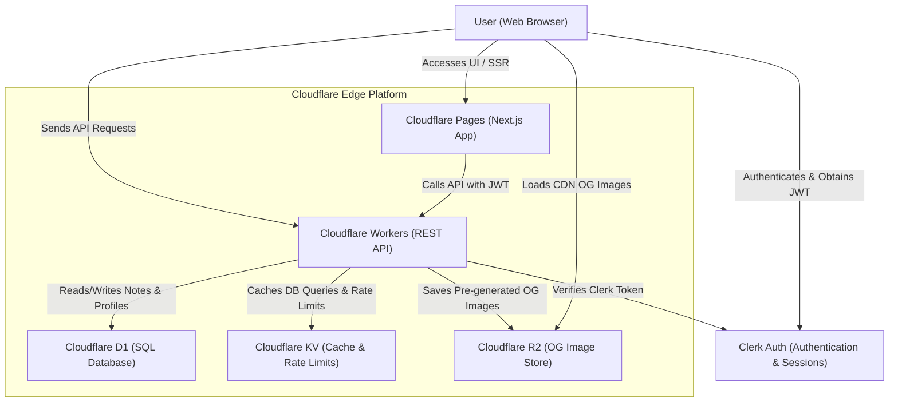

# 🏛️ Zennote System Architecture

This document outlines the architecture, data flow, and Cloudflare services integration for **Zennote**.

---

## 🗺️ Architectural Diagram

The diagram below illustrates how users, services, and storage components interact on the Cloudflare and Clerk platforms.

---

## ⚙️ Cloudflare Services Integration

Zennote is built on **Cloudflare's serverless edge infrastructure** to guarantee zero cold starts, global distribution, and high performance.

### 1. Cloudflare Pages (Frontend)
* **Technology**: Next.js 15 (deployed using `@cloudflare/next-on-pages` to compile App Router routes into Worker-compatible Edge bundles).
* **Role**: Serves the user interface, renders public pages using Server-Side Rendering (SSR) for optimal SEO, and handles Client-Side Navigation.

### 2. Cloudflare Workers (Backend)
* **Technology**: TypeScript REST API built with Cloudflare Worker handler routing.
* **Role**: Handles all authentication checks, business logic, note sharing rules, DB transactions, and OG image generation scripts.

### 3. Cloudflare D1 (SQL Database)
* **Technology**: Serverless SQLite database at the edge.
* **Role**: Stores relational metadata:
  * `users` - DB-linked user records matching Clerk IDs.
  * `user_profiles` - Public profile information (usernames, display names, bios).
  * `user_settings` - App settings (default visibilities, search indexing permissions).
  * `notes` - Note titles, contents, visibility levels, expiry dates, and slugs.
  * `note_access` - Permissions assigned to note collaborators.

### 4. Cloudflare KV (Caching & Rate Limiting)
* **Technology**: Globally distributed Key-Value store.
* **Role**:
  * Caches expensive DB queries (like public note list metadata and user profiles).
  * Performs rate limiting tracking to prevent spam or API abuse.

### 5. Cloudflare R2 (Object Storage / CDN)
* **Technology**: S3-compatible zero egress-fee object storage.
* **Role**: Stores pre-generated Open Graph (OG) images for shared notes. These are dynamically compiled using a headless canvas library on the backend and uploaded to R2, making them immediately available to social media crawlers.

---

## 🔄 Core Data Flows

### 🔑 Authentication Flow
1. User logs in via the Clerk login modal on the frontend.
2. Clerk returns a session JSON Web Token (JWT) in the browser.
3. Every request to protected API routes on the backend Worker includes this JWT in the `Authorization: Bearer <token>` header.
4. The Cloudflare Worker validates the token via Clerk's JWKS verification keys and fetches/creates the corresponding D1 user record.

### 📝 Note CRUD & Access Control
* **Public/Unlisted Notes**: Read access is allowed globally.
* **Private Notes**: The Worker checks the `note_access` table in D1 to verify the logged-in user has permission (`owner`, `admin`, `write`, or `read`).
* **Collaborator Sharing**: Note owners look up other users by their Zennote username (which queries `user_profiles` in D1), fetch their UUID, and insert a new access record into the `note_access` database.
